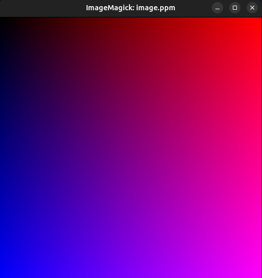

```cpp
#include <algorithm>
#include <iostream>
#include <ranges>
#include "color.hpp"
#include "pipeline_helper.hpp"
#include "utiltools.hpp"

auto main() -> int {
  constexpr std::size_t img_width = 512;
  constexpr std::size_t img_height = 512;

  auto lnorm_width = utiltools::normalize(static_cast<double>(img_width));
  auto lnorm_height = utiltools::normalize(static_cast<double>(img_height));
  auto cout_color = write_color(std::cout);
  auto make_color = [&lnorm_width, &lnorm_height](auto p) {
    using pipeline::operator|;
    auto [x, y] = p;
    auto r = x | lnorm_width;
    auto g = 0;
    auto b = y | lnorm_height;
    return Color<double>(r, g, b);
  };

  const auto rows = std::views::iota(0u, img_height);
  const auto cols = std::views::iota(0u, img_width);

  std::cout << "P3\n" << img_width << ' ' << img_height << "\n255\n";
  std::ranges::for_each(
      utiltools::cartesian_prod(rows, cols) | std::views::transform(make_color),
      cout_color);

  return 0;
}
```

