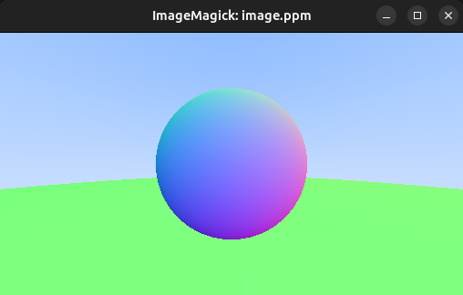

```cpp
#include <chrono>
#include <cmath>
#include <cstddef>
#include <iostream>
#include <ostream>
#include <ranges>

#include "color.hpp"
#include "globals.hpp"
#include "hit_record.hpp"
#include "hittable_list.hpp"
#include "ray.hpp"
#include "utiltools.hpp"
#include "vec3.hpp"
#include "viewport.hpp"

template <class T>
[[nodiscard]] auto ray_color(const HittableList<T>& world) {
  return [&world](auto ray) {
    HitRecord<T> hit_record;
    if (world.hit(ray, 0, globals::infinity<T>, hit_record)) {
      return 0.5 * (hit_record.normal + Color<T>{1, 1, 1});
    }

    auto unit_direction = unit_vector<T>(ray.direction());
    auto a = 0.5 * (unit_direction.y() + 1.);
    auto c = (1. - a) * Color<T>{1., 1., 1.} + a * Color<T>{0.5, 0.7, 1.};
    return c;
  };
}

auto main() -> int {
  using Vec_t = double;
  using Image_t = std::size_t;
  using globals::get_height;

  // IMAGE
  constexpr auto aspect_ratio = 16. / 9.;
  constexpr Image_t img_width = 512;
  constexpr Image_t img_height = get_height(img_width, aspect_ratio);

  // WORLD
  HittableList<Vec_t> world{};
  world.add(Sphere{Point3<Vec_t>{0, 0, -1}, 0.5});
  world.add(Sphere{Point3<Vec_t>{0, -100.5, -1}, 100.});

  // CAMERA & VIEWPORT
  const auto camera_center = Point3<Vec_t>{0., 0., 0.};
  const auto viewport = Viewport<Vec_t>{camera_center, img_width, img_height};

  // RENDER
  auto cout_color = write_color(std::cout);
  auto make_ray = viewport.ray_generator();
  auto lray_color = ray_color<Vec_t>(world);

  const auto rows = std::views::iota(0u, img_height);
  const auto cols = std::views::iota(0u, img_width);

  std::clog << "===   START   ===\n" << std::flush;
  const auto start_time = std::chrono::high_resolution_clock::now();

  std::cout << "P3\n" << img_width << ' ' << img_height << "\n255\n";
  std::ranges::for_each(utiltools::cartesian_prod(rows, cols) |
                            std::views::transform(make_ray) |
                            std::views::transform(lray_color),
                        cout_color);

  std::clog << "===   DONE    ===\n";
  const auto end_time = std::chrono::high_resolution_clock::now();
  const auto duration = std::chrono::duration_cast<std::chrono::milliseconds>(
      end_time - start_time);
  std::clog << "took: " << duration.count() << "ms\n";

  return 0;
}
```
