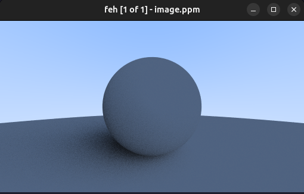

```cpp
#ifndef CAMERA_HPP
#define CAMERA_HPP

#include <algorithm>
#include <cerrno>
#include <chrono>
#include <cstddef>
#include <functional>
#include <iostream>
#include <ranges>
#include "color.hpp"
#include "globals.hpp"
#include "hittable_list.hpp"
#include "ray.hpp"
#include "vec3.hpp"
#include "viewport.hpp"

template <class T, class Image_t>
class Camera {
 public:
  Camera(const Image_t& img_width = 512)
      : m_aspect_ratio(16. / 9.),
        m_img_width(img_width),
        m_img_height(globals::get_height(m_img_width, m_aspect_ratio)),
        m_viewport(Viewport<T>(Point3<T>{0, 0, 0}, m_img_width, m_img_height)),
        m_samples_per_pixel(100),
        m_pixel_samples_scale(1. / static_cast<double>(m_samples_per_pixel)),
        m_max_depth(50) {};

  auto render(const HittableList<T>& world) const noexcept -> void;

 private:
  [[nodiscard]] auto ray_color(const Ray<T>& ray,
                               int depth,
                               const HittableList<T>& world) const noexcept
      -> Color<T>;
  [[nodiscard]] auto get_ray() const noexcept;
  [[nodiscard]] auto sample_square() const noexcept -> Vec3<T>;

  const T m_aspect_ratio{};
  Image_t m_img_width{};
  Image_t m_img_height{};
  Viewport<T> m_viewport{};
  std::size_t m_samples_per_pixel{};
  double m_pixel_samples_scale{};
  int m_max_depth{};
};

template <class T, class Image_t>
auto Camera<T, Image_t>::render(const HittableList<T>& world) const noexcept
    -> void {
  auto cout_color = write_color(std::cout);
  auto lray_color = [this, &world](auto ray) {
    return ray_color(ray, m_max_depth, world);
  };
  auto generate_color = [samples = m_samples_per_pixel,
                         scale = m_pixel_samples_scale, make_ray = get_ray(),
                         &lray_color](auto pair) {
    auto lmake_ray = [&make_ray, &pair](auto) { return make_ray(pair); };
    const auto pipe = std::views::iota(0u, samples) |
                      std::views::transform(lmake_ray) |
                      std::views::transform(lray_color);
    const auto c =
        std::ranges::fold_left(pipe, Color<T>{0, 0, 0}, std::plus<>());
    return c * scale;
  };

  const auto rows = std::views::iota(0u, m_img_height);
  const auto cols = std::views::iota(0u, m_img_width);

  std::clog << "===   START   ===\n" << std::flush;
  const auto start_time = std::chrono::high_resolution_clock::now();

  std::cout << "P3\n" << m_img_width << ' ' << m_img_height << "\n255\n";
  std::ranges::for_each(utiltools::cartesian_prod(rows, cols) |
                            std::views::transform(generate_color),
                        cout_color);

  std::clog << "===   DONE    ===\n";
  const auto end_time = std::chrono::high_resolution_clock::now();
  const auto duration = std::chrono::duration_cast<std::chrono::milliseconds>(
      end_time - start_time);
  std::clog << "took: " << duration.count() << "ms\n";
}

template <class T, class Image_t>
auto Camera<T, Image_t>::ray_color(const Ray<T>& ray,
                                   int depth,
                                   const HittableList<T>& world) const noexcept
    -> Color<T> {
  if (depth <= 0)
    return Color<T>(0, 0, 0);

  HitRecord<T> hit_record;
  if (world.hit(ray, Interval{0.001, globals::infinity<T>}, hit_record)) {
    const auto direction = Vec3<T>::random_on_hemisphere(hit_record.normal);
    return 0.5 * ray_color(Ray<T>{hit_record.p, direction}, depth - 1, world);
  }

  auto unit_direction = unit_vector<T>(ray.direction());
  auto a = 0.5 * (unit_direction.y() + 1.);
  auto c = (1. - a) * Color<T>{1., 1., 1.} + a * Color<T>{0.5, 0.7, 1.};
  return c;
}

template <class T, class Image_t>
auto Camera<T, Image_t>::get_ray() const noexcept {
  return [this](auto pair) {
    const auto i = static_cast<T>(pair.first);
    const auto j = static_cast<T>(pair.second);
    auto offset = sample_square();
    auto pixel_sample = m_viewport.pixel00_loc() +
                        ((i + offset.x()) * m_viewport.pixel_du()) +
                        ((j + offset.y()) * m_viewport.pixel_dv());
    auto ray_origin = m_viewport.camera_center();
    auto ray_direction = pixel_sample - ray_origin;
    return Ray<T>{ray_origin, ray_direction};
  };
}

template <class T, class Image_t>
auto Camera<T, Image_t>::sample_square() const noexcept -> Vec3<T> {
  return Vec3<T>(globals::random_t<T>() - 0.5, globals::random_t<T>() - 0.5, 0);
}

#endif  // !CAMERA_HPP
```

