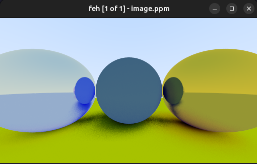

```cpp
#ifndef DIELECTRIC_HPP
#define DIELECTRIC_HPP

#include <algorithm>
#include <cmath>
#include "color.hpp"
#include "globals.hpp"
#include "ray.hpp"
#include "vec3.hpp"

template <class T>
struct HitRecord;

template <class T>
class Dielectric {
 public:
  Dielectric() : m_refraction_index(1.5) {};
  Dielectric(const T& refraction_index)
      : m_refraction_index(refraction_index) {};

  [[nodiscard]] auto scatter(const Ray<T>& ray_in,
                             const HitRecord<T>& hit_record,
                             Color<T>& attenuation,
                             Ray<T>& scattered) const noexcept -> bool {
    attenuation = Color<T>{1., 1., 1.};
    T ri =
        hit_record.front_face ? (1. / m_refraction_index) : m_refraction_index;

    auto unit_direction = unit_vector(ray_in.direction());
    auto cos_theta = std::min<T>(dot(-unit_direction, hit_record.normal), 1.);
    T sin_theta = std::sqrt(1. - cos_theta * cos_theta);

    auto cannot_refract = ri * sin_theta > 1.;

    auto direction = Vec3<T>{};
    if (cannot_refract || reflectance(cos_theta, ri) > globals::random_t<T>())
      direction = reflect(unit_direction, hit_record.normal);
    else
      direction = refract(unit_direction, hit_record.normal, ri);

    scattered = Ray<T>{hit_record.p, direction};
    return true;
  }

 private:
  [[nodiscard]] static auto reflectance(const T& cos,
                                        const T& refraction_index) noexcept
      -> T;

  T m_refraction_index{};
};

template <class T>
auto Dielectric<T>::reflectance(const T& cos,
                                const T& refraction_index) noexcept -> T {
  auto r0 = (1 - refraction_index) / (1 + refraction_index);
  r0 *= r0;
  return r0 + (1 - r0) * std::pow((1 - cos), 5.);
}

#endif  // !DIELECTRIC_HPP
```
