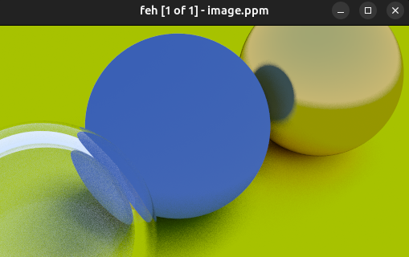

```cpp
#ifndef VIEWPORT_HPP
#define VIEWPORT_HPP

#include "vec3.hpp"
template <class T>
class Viewport {
 public:
  Viewport() = delete;
  template <class Image_t>
  Viewport(const Image_t& img_width,
           const Image_t& img_height,
           const T& focal_length = 1.,
           const T& height = 2.,
           const Vec3<T>& lookfrom = {0, 0, 0},
           const Vec3<T>& lookat = {0, 0, -1},
           const Vec3<T>& v_up = {0, 1, 0})
      : m_focal_length(focal_length),
        m_height(height),
        m_width(get_viewport_width(height, img_width, img_height)),

        m_camera_center(lookfrom),

        m_w(unit_vector(lookfrom - lookat)),
        m_u(unit_vector(cross(v_up, m_w))),
        m_v(cross(m_w, m_u)),

        m_viewport_u(m_width * m_u),
        m_viewport_v(m_height * (-m_v)),
        m_pixel_du(calculate_pixel_delta(img_width, m_viewport_u)),
        m_pixel_dv(calculate_pixel_delta(img_height, m_viewport_v)),
        m_upper_left(m_camera_center - (m_focal_length * m_w) -
                     (m_viewport_u + m_viewport_v) / 2.),
        m_pixel00_loc(m_upper_left + 0.5 * (m_pixel_du + m_pixel_dv)) {}

  [[nodiscard]] auto camera_center() const noexcept -> const Vec3<T> {
    return m_camera_center;
  }
  [[nodiscard]] auto u() const noexcept -> const Vec3<T> {
    return m_viewport_u;
  };
  [[nodiscard]] auto v() const noexcept -> const Vec3<T> {
    return m_viewport_v;
  }
  [[nodiscard]] auto pixel_du() const noexcept -> const Vec3<T> {
    return m_pixel_du;
  }
  [[nodiscard]] auto pixel_dv() const noexcept -> const Vec3<T> {
    return m_pixel_dv;
  }
  [[nodiscard]] auto upper_left() const noexcept -> const Vec3<T> {
    return m_upper_left;
  }
  [[nodiscard]] auto pixel00_loc() const noexcept -> const Vec3<T> {
    return m_pixel00_loc;
  };

 private:
  template <class Image_t>
  constexpr auto get_viewport_width(const T& height,
                                    const Image_t& img_width,
                                    const Image_t& img_height) -> T {
    return height * static_cast<T>(img_width) / static_cast<T>(img_height);
  }

  template <class Image_t>
  auto calculate_pixel_delta(const Image_t& range, const Vec3<T>& p) {
    return p / static_cast<T>(range);
  }

  T m_focal_length{};
  T m_height{};
  T m_width{};

  Vec3<T> m_camera_center{};
  Vec3<T> m_w{};
  Vec3<T> m_u{};
  Vec3<T> m_v{};
  Vec3<T> m_viewport_u{};
  Vec3<T> m_viewport_v{};
  Vec3<T> m_pixel_du{};
  Vec3<T> m_pixel_dv{};

  Vec3<T> m_upper_left{};
  Vec3<T> m_pixel00_loc{};
};

#endif  // !VIEWPORT_HPP
```
